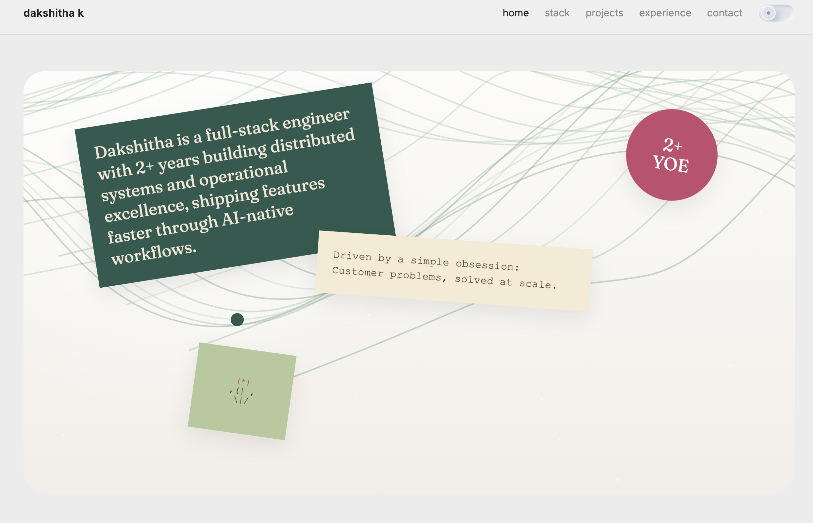
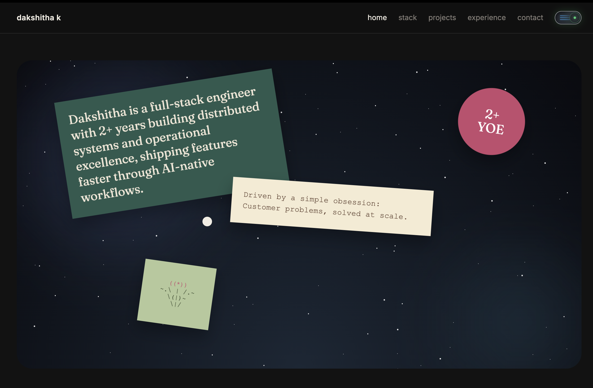
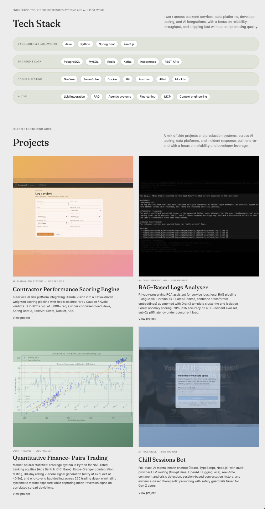
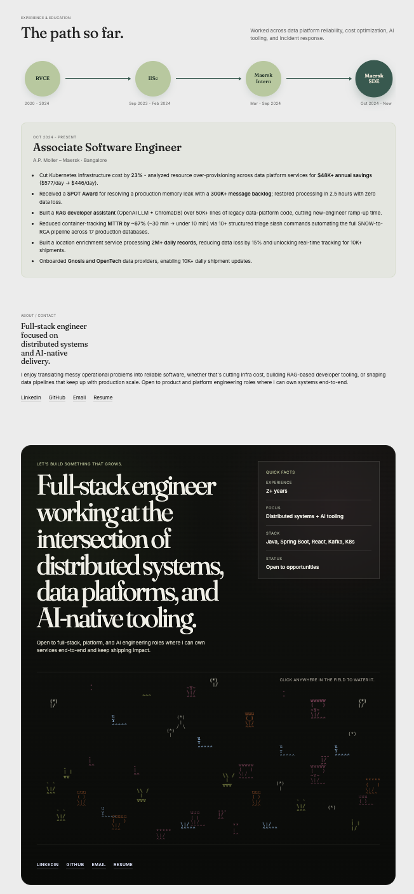

# Dakshitha K - Portfolio

Personal portfolio site for a full-stack engineer focused on distributed systems, data platforms, and AI-native tooling. Vanilla HTML/CSS/JS - no framework, no build step.

> [Live site](https://dakshithak.github.io/) 



---

## About

A handcrafted single-page portfolio with light/dark themes, an interactive hero scene, animated career timeline, project cards with image crossfade slideshows, and a playable garden in the footer. Designed to feel personal and tactile rather than templated.

## Features

- **Two distinct atmospheres** - a green-ribbon daylight scene in light mode, a starfield with glow orbs in dark mode. Theme respects system preference on first load, then user choice via the mechanical-style toggle.
- **Intro animation** - letter-by-letter reveal of the name on first load (skipped on reload via `scrollRestoration = "manual"` + hash-stripping).
- **Custom cursor** - a forest-green dot that scales on hover targets. Disabled on touch devices and when `prefers-reduced-motion` is set.
- **Project cards with image slideshows** - each card supports a single image or an N-image crossfade (2-, 3-, and 4-image rotations supported). Crossfades use staggered animation delays so transitions overlap smoothly instead of flashing through a blank state.
- **Interactive career timeline** - click any role/education milestone to expand its detail panel inline.
- **Playable footer garden** - click anywhere in the field to "water" it; nearby ASCII sprouts grow through stages.
- **Tilt-on-hover** for project cards and the handwritten-style notes in the hero.
- **Fully responsive** - hero collage collapses to a vertical stack on mobile, nav becomes a hamburger sheet.
- **Accessible** - respects `prefers-reduced-motion`, semantic landmarks, alt text on all images, keyboard-navigable timeline.

## Screenshots





## Tech stack

- **HTML5** - single `index.html`, semantic sectioning.
- **CSS** - `styles.css`. CSS custom properties for theming (light/dark via `:root[data-theme="dark"]`), `color-mix()` for surface tinting, `clamp()` for fluid typography, `aspect-ratio` for thumbnail consistency, `@keyframes` for ribbon drift / leaves / starfield / project slideshows / intro letters / garden sway / water ripples.
- **JavaScript** - `script.js`, vanilla ES2022. No build tooling. Uses `IntersectionObserver` for reveal animations and active-nav tracking, `matchMedia` for theme + reduced-motion preference, `requestAnimationFrame` for cursor and tilt smoothing.

## Local development

No build step required.

```bash
# clone
git clone https://github.com/DakshithaK/Portfolio.git
cd Portfolio

# any static server works
python3 -m http.server 8000
# or
npx serve
```

Open `http://localhost:8000` and edit any file - refresh to see changes.

## License

Personal portfolio - code is open to read for reference. Please don't redeploy as-is with my name and projects. The hero copy, project descriptions, and bio are mine.
